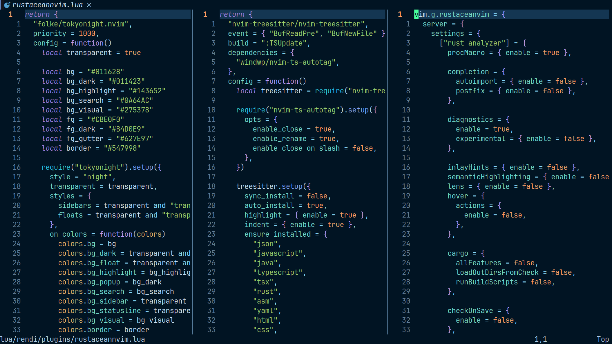
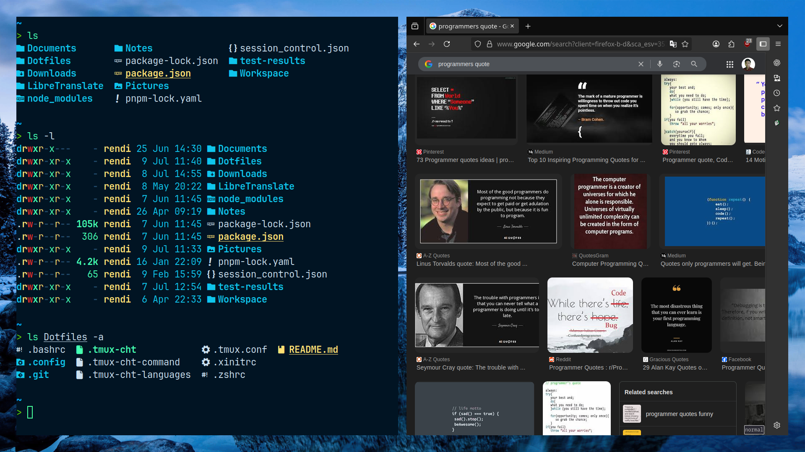
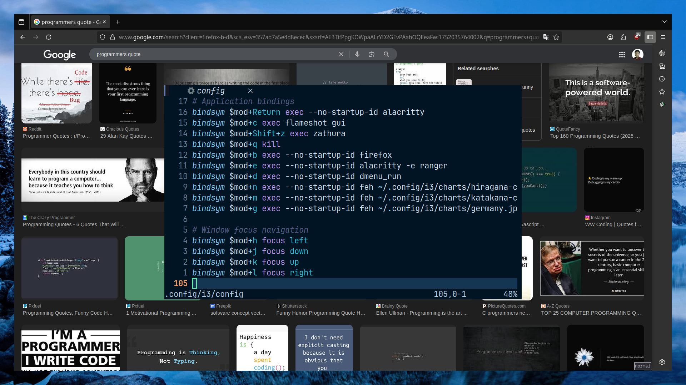

# Dotfiles

Welcome! These dotfiles are crafted for a highly efficient, distraction-free development environment on Arch Linux. Every configuration here is focused on speed, minimalism, and maximizing productivity with powerful tools and keyboard-driven workflows.

---





---

## Step-by-Step Setup

### 1. Install All Required Packages

#### Main packages (copy and run in one go):

```bash
sudo pacman -Syu \
  base-devel git stow \
  i3-gaps feh xorg-xinit maim flameshot xdotool dex unclutter xss-lock i3lock \
  alacritty zathura ranger dmenu \
  zsh fzf zoxide powerlevel10k bat ripgrep fd just tree \
  tmux xclip neovim python-pynvim \
  nodejs npm go docker docker-compose \
  cargo perl python-pip python-virtualenv
```

#### AUR packages (install with yay):

```bash
yay -S nerd-fonts-jetbrains-mono eza
```
- `nerd-fonts-jetbrains-mono` — for terminal and editor font/icons
- `eza` — improved file lister

---

### 2. Clone and Install Dotfiles

```bash
git clone https://github.com/rendivs925/Dotfiles.git
cd Dotfiles
stow .
```

---

### 3. Set zsh as Your Default Shell

```bash
chsh -s $(which zsh)
```

---

### 4. Launch Neovim (LazyVim will auto-setup on first run)

```bash
nvim
```
- Wait for plugins to install, then restart Neovim.

---

## Key Features & Usage

### i3 Window Manager

- `$mod` = Alt
- `$mod+Return` — Alacritty terminal
- `$mod+Shift+d` — Notes (Alacritty+neovim, floating)
- `$mod+d` — dmenu
- `$mod+e` — ranger in Alacritty
- `$mod+b` — Firefox
- `$mod+h/j/k/l` — Focus window
- `$mod+Shift+h/j/k/l` — Move window
- `$mod+s` (split horizontally), `$mod+w` (split vertically)
- `$mod+f` — Fullscreen
- `$mod+Shift+space` — Toggle floating
- `$mod+1..0` — Switch workspace
- `$mod+Shift+1..0` — Move window to workspace
- `Print` — Screenshot
- `$mod+Shift+Escape` — Shutdown

---

### Alacritty

- Font: JetBrains Mono 10pt
- `Alt+p` — Paste
- `Alt+c` — Copy
- `Ctrl+Shift+H/J/K/L` — Send arrows (for tmux/vim splits)

---

### zsh

- Plugins: fzf-tab, zoxide, autosuggestions, syntax highlighting, powerlevel10k
- Theme: powerlevel10k
- Aliases:  
  - Navigation: `cd`, `cdf`, `cn`, `ca`, `ci`, `cq`
  - Edit dotfiles: `nn`, `na`, `ni`, `nq`, `nz`, `nt`, `nb`, `nx`
  - Git: `ga`, `gs`, `gd`, `gds`, etc.
  - Reload: `soz`, `sob`, `sot`
- fzf:  
  - `Alt+a` — alias picker  
  - `Alt+F` — file finder  
  - `Alt+z` — history  
- `Ctrl+e` — edit/run command in nvim

---

### tmux

- Prefix: `Ctrl+a`
- Split: `|` (horiz), `-` (vert)
- New window: `c`
- Reload: `r`
- Resize: `j/k/l/h`
- Pane select: `0..9`
- Vim-aware: `Ctrl+h/j/k/l`
- Status bar: toggle `O`/`o`

---

### Neovim (LazyVim)

- **File explorer:**  
  - `<leader>ee` — Toggle nvim-tree  
  - `<leader>ef` — Toggle at current file  
  - `<leader>ec` — Collapse  
  - `<leader>er` — Refresh  
- **Telescope:**  
  - `<leader>ff` — Find files  
  - `<leader>fr` — Recent files  
  - `<leader>fs` — Live grep  
  - `<leader>fc` — Grep under cursor  
  - `<leader>ft` — Tabs  
- **LSP:**  
  - `<leader>lx` — Stop  
  - `<leader>ls` — Start  
  - `<leader>lr` — Restart  
  - `gd` — Go to definition  
- **Editing:**  
  - `Ctrl+s` — Select all  
  - `+/-` — Increment/decrement  
  - `[w`/`]w` — Wrap/no wrap  
  - `<leader>sw` — Switch window  
  - `<leader>sv` — Split vertical  
  - `<leader>sh` — Split horizontal  
  - `<leader>se` — Equal  
  - `<leader>sx` — Close split  
  - `<leader>to/tx/tn/tp/tf` — Tabs  
  - `<leader>zm` — ZenMode  

Check `lua/rendi/core/keymaps.lua` for everything.

---

## FAQ

- **Fonts look weird?**  
  Set your terminal font to JetBrainsMono Nerd Font.
- **First launch of nvim is slow?**  
  Wait for plugins to install, then restart.
- **Missing icons in nvim-tree/telescope?**  
  Install the Nerd Font and `nvim-web-devicons`.

---

## License

MIT
