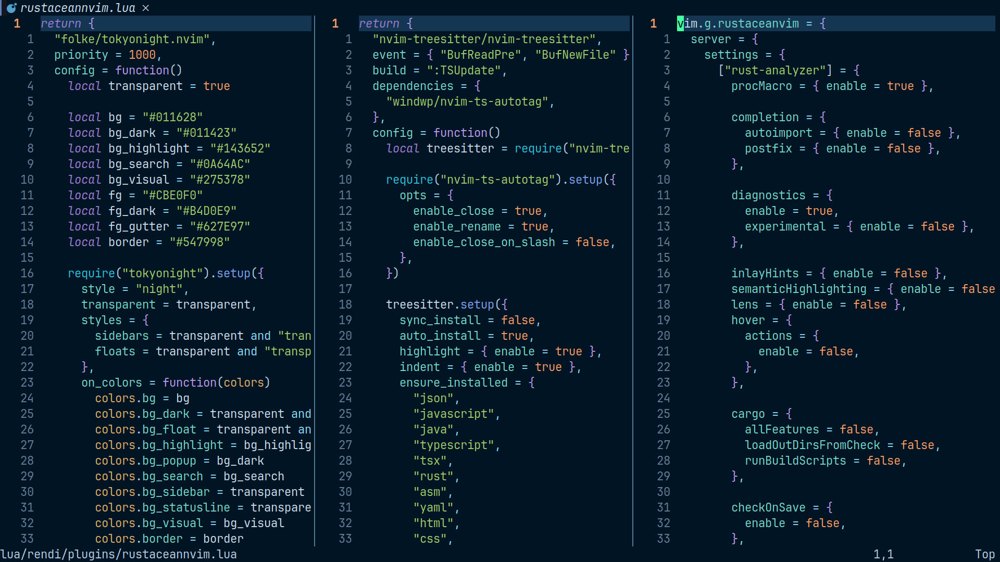
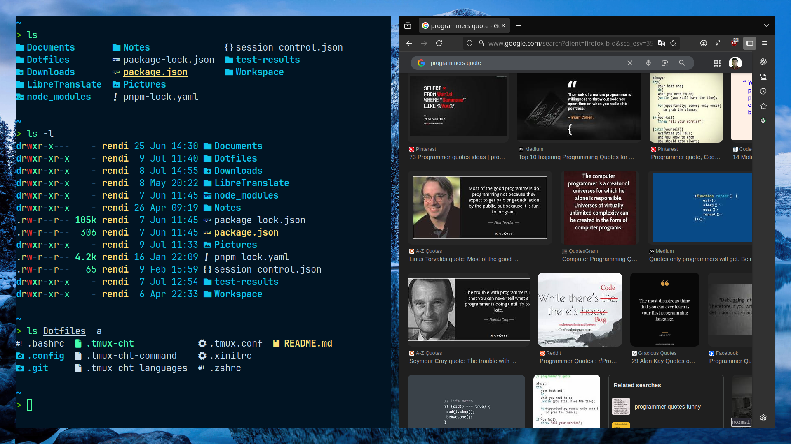
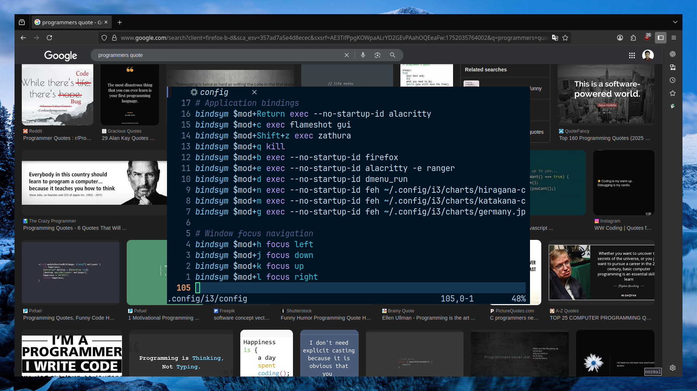

# Dotfiles

Welcome! These dotfiles are crafted for a highly efficient, distraction-free development environment on Arch Linux. Every configuration here is focused on speed, minimalism, and maximizing productivity with powerful tools and keyboard-driven workflows.

**What's included:**
- **i3** — Window manager with polybar, rofi launcher, picom compositor
- **Alacritty** — GPU-accelerated terminal with Josean Martinez dark theme
- **zsh** — Powerlevel10k prompt, fzf-tab completion, zoxide navigation, 286-entry aliases file
- **Neovim** — LazyVim-based IDE with 40+ plugins (LSP, DAP, Telescope, Treesitter)
- **tmux** — Custom prefix (C-s), vim-aware navigation, resurrect/continuum, cht.sh integration
- **polybar, picom, rofi, btop** — Desktop experience
- **~/.aliases** — 286 shell functions/aliases across 27 categories (text surgery, git, docker, network, security, crypto, binary analysis, etc.)

---





---

## Step-by-Step Setup

### 1. Install All Required Packages

#### Main packages (copy and run in one go):

```bash
sudo pacman -Syu \
  base-devel git stow \
  i3-wm feh xorg-xinit maim flameshot xdotool dex unclutter xss-lock i3lock \
  alacritty zathura ranger rofi \
  zsh fzf zoxide powerlevel10k bat ripgrep fd just tree eza \
  tmux xclip neovim python-pynvim \
  nodejs npm go docker docker-compose \
  cargo perl python-pip python-virtualenv \
  btop picom polybar networkmanager \
  imagemagick ghostty
```

#### AUR packages (install with yay):

```bash
yay -S nerd-fonts-jetbrains-mono
```
- `nerd-fonts-jetbrains-mono` — for terminal and editor font/icons

#### Security tools (optional, install via `sec-tools`):

After setup, run `sec-tools` to install nmap, whois, socat, httpie, exiftool, sqlmap, nikto for the security & recon functions.

---

### 2. Clone and Install Dotfiles

```bash
git clone https://github.com/rendivs925/Dotfiles.git
cd Dotfiles
stow .
```

---

### 3. Set zsh as Your Default Shell

```bash
chsh -s $(which zsh)
```

---

### 4. Launch Neovim (LazyVim will auto-setup on first run)

```bash
nvim
```
- Wait for plugins to install, then restart Neovim.

### 5. (Optional) Install Security Tools

```bash
soz && sec-tools
```
- Installs: nmap, whois, socat, httpie, exiftool, sqlmap, nikto
- Skip if not needed; all aliases degrade gracefully for missing tools.

---

## Key Features & Usage

### i3 Window Manager

- `$mod` = Alt
- `$mod+Return` — Alacritty terminal
- `$mod+Shift+d` — Notes (Alacritty+neovim, floating)
- `$mod+d` — rofi app launcher (aura-dark theme)  
- `$mod+y` — rofi clipboard manager (clipmenu)
- `$mod+e` — yazi file manager in Alacritty (floating)
- `$mod+b` — qutebrowser
- `$mod+z` — zathura PDF reader
- `$mod+h/j/k/l` — Focus window
- `$mod+Shift+h/j/k/l` — Move window
- `$mod+s` (split horizontally), `$mod+w` (split vertically)
- `$mod+f` — Fullscreen
- `$mod+Shift+space` — Toggle floating
- `$mod+1..0` — Switch workspace
- `$mod+Shift+1..0` — Move window to workspace
- `$mod+c` — Flameshot screenshot GUI  
- `Print` — Screenshot (maim)
- `$mod+Shift+Escape` — Shutdown
- **Polybar:** custom bar with workspace indicators, date/time (Indonesian locale), wifi SSID, uptime, system tray
- **Wallpaper:** cycle through 10+ nature/landscape images (Ctrl+1..9)

---

### Alacritty

- Font: JetBrains Mono 12pt
- Opacity: 0.8
- `Alt+p` — Paste
- `Alt+c` — Copy
- `Alt+h/j/k/l` — Send arrows (for tmux/vim navigation)  
- Theme: Josean Martinez / aura.toml inspired dark scheme (background `#011423`, foreground `#CBE0F0`, accent cyan `#0FC5ED`, accent green `#47FF9C`)

---

### zsh

- Plugin manager: zsh-defer (lazy-loads zoxide, autosuggestions, syntax highlighting, fzf-tab, nvm)
- Plugins: fzf-tab, zoxide, autosuggestions, syntax highlighting, powerlevel10k, zsh-alias-finder
- Theme: powerlevel10k (lean style)
- Config: `~/.zshrc` sources `~/.aliases` (286 entries across 27 categories)
- fzf:  
  - `Alt+a` — fzf alias picker (browse/search all aliases)  
  - `Alt+F` — fzf file finder (CTRL-T style)  
  - `Alt+z` — fzf history search (CTRL-R style)  
  - `Ctrl+G` — AI chat widget
- `Ctrl+e` — edit current command line in nvim
- `Ctrl+E` — edit-command-line widget

---

---

### `~/.aliases` — Complete Reference

All aliases and shell functions are consolidated in `~/.aliases` (sourced by `.zshrc`).  
Categories below with real-world usage examples.

---

#### System & Process
```bash
sysinfo              # Show OS, kernel, CPU, memory summary
sysdisk              # Disk usage (df -h)
sysmem               # Memory info (free -h)
syscpu               # CPU details (lscpu summary)
sysuptime            # Uptime formatted
systemp              # Temperatures (needs lm_sensors)
procs nginx          # List processes matching name
prockill nginx       # Kill all processes by name
proctop cpu          # Top processes by CPU usage
procmon chrome       # Watch chrome processes live
```

#### Display
```bash
fps_60               # Set eDP to 60Hz
dual_monitor         # Enable eDP + 4K HDMI side-by-side
external_only        # 4K HDMI only, eDP off
internal_only        # Laptop screen only, HDMI off
brightness 0.5       # Set both screens to 50%
```

#### Navigation
```bash
cd project           # zoxide smart jump to directory
cdf                  # cd ~/Dotfiles/
cn                   # cd ~/.config/nvim
ca                   # cd ~/.config/alacritty
ci                   # cd ~/.config/i3
cq                   # cd ~/.config/qutebrowser
cgh                  # cd ~/.config/ghostty
cbt                  # cd ~/.config/btop
cpoly                # cd ~/.config/polybar
crof                 # cd ~/.config/rofi
```

#### Dotfile Editing
```bash
nn                   # nvim ~/.config/nvim
nz                   # nvim ~/.zshrc
nali                 # nvim ~/.aliases
nt                   # nvim ~/.tmux.conf
na                   # nvim ~/.config/alacritty/alacritty.toml
ni                   # nvim ~/.config/i3/config
nq                   # nvim ~/.config/qutebrowser/config.py
nb                   # nvim ~/.bashrc
nx                   # nvim ~/.xinitrc
np                   # nvim ~/.config/picom/picom.conf
npo                  # nvim ~/.config/polybar/config
nro                  # nvim ~/.config/rofi/config.rasi
nla                  # nvim ~/.config/lazygit/config.yml
```

#### Shell Reload
```bash
soz                  # source ~/.zshrc
soa                  # source ~/.aliases
sob                  # source ~/.bashrc
sot                  # tmux source ~/.tmux.conf
```

#### Shell Utils
```bash
e                    # exit
c                    # Clear screen in all tmux panes at once
n                    # nvim
nano                 # nvim (muscle memory)
r                    # ranger file manager
sn                   # sudoedit
skey                 # screenkey (keystroke display for screencasts)
nowrap               # Disable terminal line wrap
wrap                 # Enable terminal line wrap
cat                  # bat --paging=never
grep                 # ripgrep
```

#### File & Search
```bash
ff config            # Fuzzy-find files matching "config", preview with bat
fdext json           # Find all .json files
fdir cache           # Fuzzy-find directories matching "cache"
rgi "TODO|FIXME"     # Search code interactively with fzf preview
rgf "api_key"        # List files containing pattern
rgc "error"          # Count matches per file, sorted
rgctx "timeout" .    # Search with 3-line context
todo                 # Scan for TODO/FIXME/HACK/BUG/XXX/NOTE
rgurl file.txt       # Extract all URLs from file
rgip access.log      # Extract all IP addresses
rgemail docs/        # Extract all email addresses
fdcount "*.rs"       # Count files matching pattern
fdsize "*.log"       # Total size of files matching pattern
fddel "*.tmp"        # Delete files matching pattern (with confirmation)
```

#### Replace & Trim
```bash
sdrun "old" "new" "*.md"      # Dry-run: show matches before replacing
sdall "old" "new" "*.txt"     # Replace literal text across files
sdrxrun '[ ]+$' '' '*.sh'     # Dry-run regex replacement
sdrxall '[ ]+$' '' '*.sh'     # Apply regex replacement
trimfiles '*.md'               # Remove trailing whitespace from files
```

#### Git
```bash
ga                         # git add
gs                         # git status
gd                         # git diff
gds                        # git diff --staged
gc                         # git checkout
gcb feature/new-thing      # git checkout -b
gb                         # git branch
gba                        # git branch -a
gl                         # git log --graph --oneline --decorate --all
gcl repo.git               # git clone
gpl                        # git pull
gp                         # git push
gpf                        # git push --force-with-lease
gco                        # git commit
gcm "fix: handle edge case"# git commit -m
gca                        # git commit --amend
gundo                      # git reset --soft HEAD~1
grb                        # git rebase
grbi                       # git rebase -i
grbc                       # git rebase --continue
grbm                       # git rebase origin/main
grv                        # git remote -v
grh                        # git reset --hard
grs                        # git restore
grss                       # git restore --staged
gst                        # git stash
gsta                       # git stash apply
gstp                       # git stash pop
gsts                       # git stash show --patch
gstas                      # List all stashes with dates
grfl                       # git reflog
gsw                        # git switch
gswc new-branch            # git switch -c
gclean                     # git clean -fd
gprune                     # Delete merged local branches
glogf src/main.rs          # Git log for specific file
gchange                    # Show recently changed files
gpr 42                     # Checkout PR #42
grem                       # List remote branches
gloc                       # Count lines of code
gcon                       # List contributors
gignore "*.log"            # Append pattern to .gitignore
```

#### Build Tools (Just, Docker, Cargo)
```bash
j                          # just
jsb                        # just sb
dcu                        # docker compose up
dcw                        # docker compose watch
dcd                        # docker compose down
dcl                        # docker compose logs -f
dce app bash               # docker compose exec app bash
dcps                       # docker compose ps
dprune                     # docker system prune -af
dbuild myapp .             # docker build -t myapp .
dip container_name         # Show container IP address
cw                         # cargo watch -q -c -w src/ -x "run -q"
cac                        # cargo check
cat                        # cargo test
cab                        # cargo build
car                        # cargo run
caf                        # cargo fmt
cad                        # cargo doc --open
caclean                    # cargo clean
cr                         # cargo remote
```

#### Tmux
```bash
t                          # tmux
tl                         # List sessions
tn mysession               # New session named "mysession"
ta mysession               # Attach to session
tk mysession               # Kill session
tks                        # Kill tmux server
tw                         # List windows in current session
ts                         # List all sessions
```

#### Text Surgery — Analysis
```bash
rg "error" app.log | freq  # Frequency table of lines
words report.txt           # Word frequency
cat data.csv | sumcol 3 ','       # Sum column 3 of CSV
cat metrics.tsv | avgcol 5 '\t'   # Average column 5 of TSV
cat access.log | topfield 1       # Most frequent IPs
```

#### Text Surgery — Extraction
```bash
rxonly '[A-Z]+-\d+' file.txt      # Extract pattern matches
cutc '1,3,5' ',' data.csv         # Cut columns 1,3,5 from CSV
between '^BEGIN' '^END' file.txt  # Lines between two patterns
untilpat '^---$' file.txt         # Lines until first match
splitby '^### ' notes.md chunk_   # Split file on pattern matches
catuniq a.txt b.txt               # Concatenate deduplicated
intersect old.txt new.txt         # Lines common to both files
commdiff a.txt b.txt              # Lines unique to each file
```

#### Text Surgery — Transform
```bash
echo "Messy  Input" | ws1         # Normalize whitespace
echo "HELLO" | lower              # lowercase
echo "hello" | upper              # UPPERCASE
echo "Hello World" | snake        # hello_world
echo "hello world" | camel        # helloWorld
echo "Hello World" | kebab        # hello-world
echo "hello world" | title        # Hello World
```

#### CSV & Data
```bash
csvcol data.csv                         # List column headers
csvview ',' data.csv                    # Align CSV into columns
csvjoin users.csv orders.csv 1          # Join on column 1
csvdedup data.csv 1                     # Deduplicate by column 1
csvsort data.csv 3                      # Sort by column 3
csvstats data.csv 4                     # Stats on column 4 (min/max/avg)
csvslice data.csv 10 20                 # Extract rows 10-20
```

#### JSON
```bash
jpp data.json                           # Pretty-print JSON
jpick '.users[] | [.id,.email]' file    # Extract paths as TSV
jsonvalid data.json                     # Validate JSON
jsonflat data.json .name                # Flatten a key
jsonwalk data.json                      # Interactive JSON explorer (fzf + jq)
```

#### Encoding
```bash
cat file.txt | b64enc                   # Base64 encode
echo "aGVsbG8=" | b64dec                # Base64 decode
echo "hello world" | urlenc             # URL encode
echo "hello%20world" | urldec           # URL decode
echo "test" | hexencode                 # Hex encode
echo "74657374" | hexdecode             # Hex decode
```

#### Batch Ops
```bash
batchrn 's/old/new/' '*.txt'           # Batch rename files
batchcp '*.conf' '.bak'                 # Batch backup with suffix
batchchmod 755 '*.sh'                   # Batch chmod
batchconvert png '*.jpg'                # Batch convert images (needs imagemagick)
batchresize 800x600 '*.png'             # Batch resize images
dedupfiles ~/downloads                  # Find duplicate files by MD5
deduplines data.txt                     # Remove duplicate lines in-place
```

#### Archive
```bash
tarc archive.tar.gz file1 dir2/        # Create tar.gz
tarx archive.tar.gz                     # Extract any archive (tar.gz/zip/rar/7z)
tarl archive.tar.gz                     # List archive contents
```

#### Network & Port
```bash
myip                                    # Show public IP
myips                                   # Show all local IPs
listenports                             # Show all listening ports locally
portscan example.com                    # Scan common ports (auto: nmap or /dev/tcp)
fastscan example.com                    # Quick top 20 ports
detectservices example.com              # Grab banners to identify services
netstat                                 # All sockets (ss -tulanp)
netinfo example.com                     # Full: DNS + ping + traceroute + ports
```

#### DNS
```bash
dnscheck example.com                    # Full DNS: A, AAAA, MX, NS, TXT
dnsptr 8.8.8.8                         # Reverse DNS lookup
dnsmail example.com                     # MX records only
```

#### HTTP & API
```bash
httpstatus https://example.com          # HTTP status code only
httpheader https://example.com          # Response headers only
httpbody https://example.com            # Response body only
apicheck https://api.example.com/users  # Full endpoint check (method, status, type, body)
apiscan https://example.com             # Test common paths (/api, /health, /swagger, etc.)
headcheck https://example.com           # Security header audit (HSTS, CSP, XFO, etc.)
cookiecheck https://example.com         # Cookie security analysis
csrfcheck https://example.com/login     # Check for CSRF tokens
```

#### SSL / TLS
```bash
sslcheck example.com:443                # Cert details (issuer, expiry, SANs)
ssltest example.com                     # Test supported protocols + ciphers
```

#### Security & Recon
```bash
recon-audit                             # Local system audit: ports, SUID, sudo, logins
recon-webcheck https://example.com      # Full web recon: SSL + headers + paths
suspicious file.txt                     # Scan for IPs, URLs, emails, base64, secrets
sec-status                              # Show which security tools are installed
sec-tools                               # Install all missing security tools (nmap, whois, etc.)
```

#### Binary Analysis
```bash
analyze /bin/ls                         # Full file autopsy: file, strings, hex, ldd, entropy, ELF info
stringsx binary 8                       # Extract strings with min length 8
hexview binary 256                      # Hex dump first 256 bytes
entropy binary                          # Shannon entropy estimate (detect packed/encrypted)
cmpbin file1 file2                       # Byte-by-byte comparison
peek binary 0 64                        # Read 64 bytes at offset 0
exif image.jpg                          # Metadata extraction (needs exiftool)
```

#### Crypto & Passwords
```bash
genpass                                 # Random 24-char password (symbols included)
genpass-simple 16                       # Alphanumeric only
genuuid                                  # Generate UUID v4
hash file.txt                           # Show MD5 + SHA1 + SHA256 + SHA512 at once
hashall ~/documents                      # Hash all files, write checksums.txt
crypt secret.txt                         # Encrypt file (AES-256-CBC + PBKDF2)
decrypt secret.txt.enc                   # Decrypt file
seal project/                            # Tar + gzip + encrypt directory
unseal project.tar.gz.enc               # Decrypt + extract
gpg-enc file.txt user@example.com       # GPG encrypt for recipient
gpg-dec file.txt.gpg                     # GPG decrypt
totp JBSWY3DPEHPK3PXP                   # Generate TOTP 2FA code from base32 secret
```

#### Log Auditing
```bash
logcheck /var/log/auth.log              # Scan for failed auth, sudo, errors
secwatch /var/log/nginx/access.log      # Tail log with real-time security highlighting
sudocheck 20                            # Last 20 sudo entries
lastlogins 10                           # Last 10 login attempts (success + fail)
```

#### Productivity
```bash
mkcd new-project                        # mkdir -p && cd
hist 20                                 # Top 20 most-used commands
histn "git" 10                          # Search history for "git", top 10
extract archive.tar.gz                  # Auto-detect and extract any archive
here                                    # Create temp dir and cd into it
cheat tar                               # Search cheat.sh for tar examples
epoch 1700000000                        # Convert epoch to human date
count                                   # Count files in current dir
size ~/projects                         # Show total size (du -sh)
findtext "FIXME"                        # Interactive text search with preview
colors                                  # Show 256 terminal color chart
path                                    # Show PATH one per line
fm                                      # Open file manager (ranger or nnn)
paint "text"                            # Print text with rainbow colors
```

#### Clipboard
```bash
cat file | cbcopy                       # Copy to clipboard
cbpaste | jq .                          # Paste and pipe
```

---

### tmux

- Prefix: `Ctrl+s`
- Split: `|` (horiz), `-` (vert)
- New window: `c`
- Reload config: `r`
- Resize pane: `j/k/l/h`
- Pane select: `0..9`
- Vim-aware navigation: `Ctrl+h/j/k/l`
- Status bar toggle: `O` (off), `o` (on)
- Quick cheatsheet: `i` (opens cht.sh in new window)

---

### Neovim (LazyVim-based, custom `lua/rendi/` structure)

- **File explorer:**  
  - `<leader>ee` — Toggle nvim-tree  
  - `<leader>ef` — Reveal current file  
  - `<leader>ec` — Collapse tree  
  - `<leader>er` — Refresh tree  
- **Telescope:**  
  - `<leader>ff` — Find files  
  - `<leader>fr` — Recent files  
  - `<leader>fs` — Live grep  
  - `<leader>fc` — Grep under cursor  
  - `<leader>ft` — Telescope tabs  
- **LSP:**  
  - `gd` — Go to definition  
  - `gr` — References  
  - `gi` — Implementation  
  - `<leader>cx` — Code actions  
  - `<leader>rn` — Rename  
  - `<leader>D` — Type definition  
  - `[d` / `]d` — Previous/next diagnostic  
- **Debugging (nvim-dap):**  
  - `<leader>db` — Toggle breakpoint  
  - `<leader>dc` — Continue  
  - `<leader>do` — Step over  
  - `<leader>di` — Step into  
- **Editing:**  
  - `Ctrl+s` — Select all  
  - `+/-` — Increment/decrement number  
  - `[w` — Wrap line, `]w` — No wrap  
  - `<leader>sw` — Switch window  
  - `<leader>sv` — Split vertical  
  - `<leader>sh` — Split horizontal  
  - `<leader>se` — Equalize splits  
  - `<leader>sx` — Close split  
  - `<leader>to/tx/tn/tp/tf` — Tab operations  
  - `<leader>zm` — Zen mode  
- **Git:**  
  - `<leader>gg` — Lazygit toggle  
  - `<leader>gd` — Git diff hunk  
  - `<leader>gp` — Git preview hunk  
- **Other plugins:** auto-session, indent-blankline, leap, surround, substitute, trouble, which-key, conform (auto-format), autopairs, comment, silicon (code screenshot), markdown-preview

Check `~/.config/nvim/lua/rendi/` for per-plugin configuration.

---

## FAQ

- **Fonts look weird?**  
  Set your terminal font to JetBrainsMono Nerd Font.
- **First launch of nvim is slow?**  
  Wait for plugins to install, then restart.
- **Missing icons in nvim-tree/telescope?**  
  Install the Nerd Font and `nvim-web-devicons`.

---

## License

MIT
